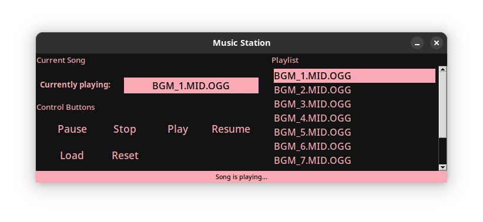

# 📻 Music Station - Music Player App

**Version**: 2.0.0

**Author**: Joa98



A Python-based music player application built with Pygame and Tkinter, supporting playlists, audio visualization, and playback controls.

## 🚀 Features

- Play/pause, resume, stop, load and reset controls.
- Playlist management (add/remove tracks)
- Compatible with: 
    - *mp3*
    - *ogg*
    - *wav*
- Operates entirely offline for maximum privacy
- Never stores any users data.

## Requirements

- **Python 3.10+**
- **Pygame** (installed automatically via `requirements.txt`)
- Linux/Windows/macOS

## ⚙️ Installation

### 🐧 Linux (Ubuntu)

    ```bash
# Install Python and Git
sudo apt update && sudo apt install python3 python3-pip git

# Clone the repository
git clone https://github.com/Joa98Dev/music-station.git
cd music-station

# Set up a virtual environment
Python3 -m venv
source venv/bin/activate

# install dependencies
pip install -r requirements.txt

# Run the app
python main.py
```

### 🐧 Linux (Arch)

```bash
# Install Python and Git
sudo pacman -S python python-pip git

# Clone the repository
git clone https://github.com/Joa98Dev/music-station.git
cd music-station

# Set up a virtual environment
python -m venv venv
source venv/bin/activate

# Install dependencies
pip install -r requirements.txt

# Run the app
python main.py
```

### 🪟 Windows 10/11

```
# Install Python from https://python.org (check "Add to PATH" during installation)
# Open CMD/PowerShell as Administrator

# Clone the repo
git clone https://github.com/Joa98Dev/music-station.git
cd music-station

# Set up a virtual environment
python -m venv venv
venv\Scripts\activate

# Install dependencies
pip install -r requirements.txt

# Run the app
python main.py
```

### 🍎 macOS

```
# Install Homebrew (if not installed)
/bin/bash -c "$(curl -fsSL https://raw.githubusercontent.com/Homebrew/install/HEAD/install.sh)"

# Install Python and Git
brew install python git

# Clone the repo
git clone https://github.com/Joa98Dev/music-station.git
cd music-station

# Set up a virtual environment
python3 -m venv venv
source venv/bin/activate

# Install dependencies
pip install -r requirements.txt

# Run the app
python3 main.py
```

## ⌨️ How to use it?

1. Open the Music Station App
2. Press the **load** button (A new window will open)
3. Selected your audio file or playlist.
4. Press the **Open** button
5. Use the controls to play to play your playlist.
