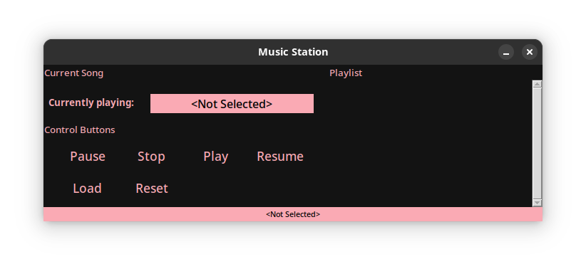
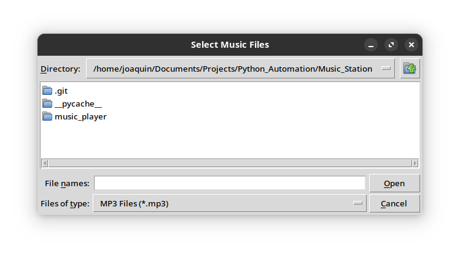
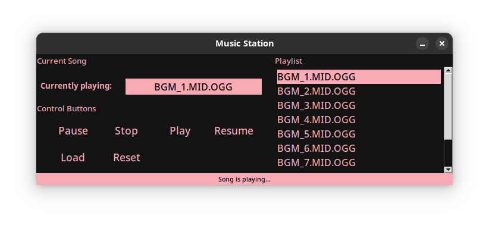

# Music Station 📻

A simple and minimal music player built with Python, using the Tkinter and Pygame libraries. This is an improved version of an old project I created, where I optimized the code, restructured the app, and applied better programming practices.

## How to use it? 🤔

Turn the virtual environment on:

* **Linux** and **Mac**: `source music_player/bin/activate`

* **Windows**: `music_player\Scripts\activate`

1. Press the **load** button.

2. Look for your music folder and select it.

3. Done! Now your playlist has been loaded.

You can Select which song of the playlist you want to listen to, as well as filter the format of the audio.

Also you can reset the music player to load another playlist, pause, resume, stop the music/playlist.

The Music player can play:

* mp3

* ogg

* wav

## Free Usage 🆓
I made this basic program with educational purpouses.

I relied to [Python Geek](https://pythongeeks.org/python-music-player/) as the main guide for developing this program.

Feel free to clone this repository, modify the code, and make changes 😁.
