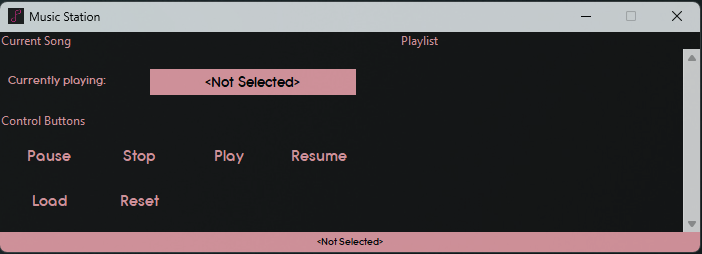
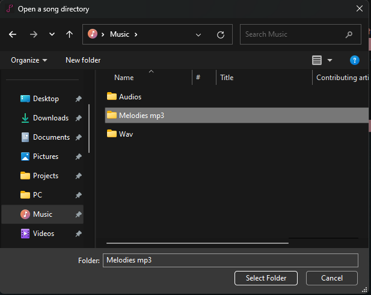
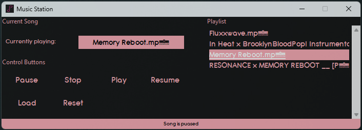

# Music Station 📻
This is a simple but pretty music player.
Made it with Python and using the Tkinter and Pygame libraries.

## How to use it? 🤔
1. Press the **load** button.

2. Look for your music folder and select it.

3. Done! Now your playlist has been loaded.

You can Select which song of the playlist you want to listen to.

Also you can reset the playlist to load another, puase, resume or stop the songs.

The Music player can play:
* mp3
* ogg
* wav

## Free Usage 🆓
I made this basic program with educational purpouses.

I relied to [Python Geek](https://pythongeeks.org/python-music-player/) as the main guide for developing this program.

Feel free to clone this repository, modify the code, and make changes. Enjoy your coding time! 😁⌨️.

